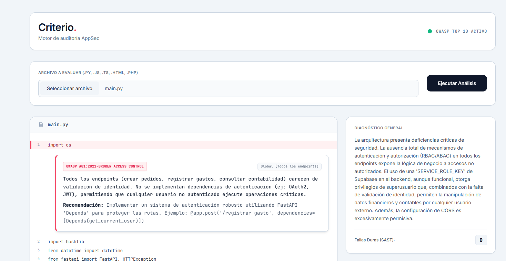

**Documentación Técnica**

Esta documentación proporciona una especificación tecnica para el motor de auditoria estatica avanzada y simulación ofensiva basado en inteligencia 
artificial

**Ficha Técnica del sistema**

*Arquitectura de Backend:* FastAPI con un paradigma asincrono
*Orquestación de AI:* LangChain Core, salidas estructuradas mediante Pydantic
*Modelo de lenguaje Utilizado:* Google Gemini (gemini-3.1-flash-lite) linea generativeAI
*Estilo de Frontend:* SPA responsiva con HTML5, Javascript asincrono y Tailwind CSS

**Arqutectura del sistema multi-agente**

El nucleo de criterio V.1.0 no depende de un unico prompt masivo, sino de una estructura lineal y reflexiva donde interactuan cuatro roles, bajo un flujo que garantiza que cada hallazgo este validado ofensivamente y cuente con una solucion testeada antes de ser enviada al usuario.

Cuando el endpoint asincrono de FastAPI recibe el codigo fuente es confinado a un entorno seguro aislado a travez de archivos temporales del servidor, el primer agente es el *Auditor* configurado bajo un rol de ingeniero Senior AppSec quien es el encargado de escanear la sintaxis y semantica del codigo fuente, buscando debilidades logicas alineadas con el OWASP Top 10 mapeando las lineas de inicio y la gravedad del fallo. 

Posteriormente el reporte generado por el auditor es heredado al segundo agente denominado *Hacker* quien actua como un Red Team, es decir valida si el fallo detectado es realmente explotable en un escenario real de producción, si determina que el riesgo es real diseña un vector de ataque detallado y genera un payload para demostrar como un atacante podria comprometer el entorno. En la ultima etapa se genera un bucle cerrado de optimización y control de calidad donde el tercer agente denominado *Parcheador* recibe el codigo fuente junto con los vectores de explotación y redacta una propuesta de codigo seguro, indicando los bloques exactos que deben ser reemplazados o inyectados, este parche se envia al cuarto agente denominado *Juez* quien evalua la integridad sintatica de la solución propuesta detectando si el parche rompe la logica del programa o introduce nuevos fallos, entonces obliga al parcheador a refactorizar el codigo hasta que el veredicto sea aprobatorio.

*Flujo de trabajo del sistema multiagente*

1. El auditor consume el codigo completo y mapea los problemas estructurando la salida bajo un esquema de validación

*"class ReporteAuditor(BaseModel):*
   *resumen: str = Field(description="Diagnóstico global ejecutivo de la arquitectura y calidad del archivo analizado.")*
    *hallazgos: List[HallazgoSeguridad] = Field(default=[], description="Lista de vulnerabilidades encontradas.")"*

   Fuerza la extracción de endpoints, lineas exactas, descripciones contextuales y la categoria OWASP especifica en un formato JSON

2. El Red Team recibe el JSON del auditor y para cada hallazgo como Inseguro, diseña un vector de ataque detallado, un escenario de amenaza y genera un Payload (PoC) sintactico para simular la explotación

3. El parcheador genera una propuesta asociando lineas del codigo modificadas

*"class ReporteParcheador(BaseModel):*
    *parches: List[ParcheCodigo] = Field(default=[], description="Lista de soluciones en código.")"*

El juez QA recibe el codigo propuesto y lo audita internamente en un bucle cerrado de maximo 3 intentos, sí el QA detecta que el parche introducce errores emite una critica y el parcheador deberá reescribirlo, una vez aprobado se rompe el ciclo y se consolida el return.

*"if veredicto.parche_exitoso:*
                *parche_aprobado = True*
                *logger.info(f" Veredicto: Parche Aprobado en el intento {intento_actual}.")"*

*"return {*
            *'status': 'success',*
            *'archivo': nombre_archivo,*
            *'hallazgos_sast_puros': len(vulnerabilidades_sast),*
            *'codigo_original': codigo_fuente,*
            *'auditoria': respuesta_auditor,*
            *'hacking': respuesta_hacker,*
            *'parches': respuesta_parcheador*
        *}*

**Archivos de Prueba**

El sistema incluye dos codigos fuente diseñadas especificamente para probar el umbral de derección y logica del motor

*archivo 1: Prueba.py*

Este archivo emula un backend para la gestión de infraestructura fisica a travez del endpoint */api/v2/equipos* estructurado usando controladores tipicos de FastAPI y consultas ORM con SQLAlchemy, bajo este archivo de prueba se busca evaluar los fallos logicos en el control de acceso, así como inyecciones de datos en estructuras mutables y SSRF.

Las vulnerabilidades que se incluyen y debe encontrar el aplicativo son:

1. Inyección Mass Assignment donde el esquema EquipoUpdateDTO incluye la regla *model_config = {"extra": "allow"}* que permite a un atacante inyectar parametros maliciosos no definidos en el modelo hacia la base de datos. 

2. Server-Side Request Forgery donde el endpoint de registro de Webhooks realiza una petición directa *(requests.get(config.endpointint_url))* utilizando un parametro controlado completamente por el usuario externo, permitiendo escanear la red interna del servidor o extraer metadatos de la nube.

3. Race Condition donde el endpoint */reclamar-pieza* calcula el inventario en memoria *nuevo_stock=pieza.stock_disponible -1* y luego actualiza, en lugar de realizar una operación atómica directamente en el motor SQL, cuando hay alta concurrencia genera inconsistencias de stock vulnerando la logica de negocio.

*archivo 2: Prueba2.py*

Este script representa un backend de Machine Learning encargado de procesar canales de datos, ingesta de documentos vectoriales o RAG y Fine-Tuning distribuidos en clusters de GPU donde se busca medir la capacidad del motor de identificar ataques criticos dirigidos a la infraestructura que hospeda servicios de AI

Las vulnerabilidades que se incluyen y debe encontrar el aplicativo son:

1. RCE por deserialización insegura donde el uso de *pickle.load(f)* para cargar los pesos y configuraciones de modelos personalizados puede dar a que un archivo .pkl modificado llegue a ejecutar comandos arbitrarios del sistema operativo en el momento del desempaquetado

2. Inyección de Comandos de S.O en donde el uso de *subprocess.Popen(comando, shell=True)* en concatenación con variables dinamicas de usuario *job_name* permite inyectar operadores de consola para tomar control total del contenedor o servidor

3. Path Transversal Arbitrario, bajo el cual el endpoint */rag/upload-corpus* concatena directamente *document.filname* en las rutas del sistema de archivos mediante *os.path.join*, en este escenario un atacante puede enviar nombres de archivo con secuencias de escape tipo *../../../../etc/cron.d/* para comprometer la integridad del S.O

**Escalabilidad**

Para transformar *Criterio* de un motor de auditoria multiagente que analiza archivos de manera individual a una plataforma SaaS de nivel industrial que pueda ser capaz de escanear repositorios completos con ramas, dependencias y demas archivos concurrentemente, se requiere transicionar a una arquitectura distribuida y asincrona basada en eventos.

Como propuesta se considera generar una capa de ingesta y webhooks donde se registre una GitHub App o se configuren Webhooks organizacionales en los repositorios objetivo con el fin de hacer un *push* o un *Pull Request* para reconocer si hay nuevo codigo para auditar, cada evento envia una carga util JSON de alta velocidad a un microservicio de FastAPI ligero, empaquetando y lanzado a una base de datos en memoria ultra rapida como Redis y respondiendo con un 202 en ms para evitar bloqueos por tiempo de espera.

De acuerdo a la cantidad de repositorios para auditar se levantan Wokers con el fin de consolidar escalabilidad horizontal, se monta el repositorio en un directorio temporal en tmpfs donde este se clona directamente en la memoria RAM siendo volatil y seguro, luego debe usarse un analizador AST quien mapeará el codigo para identificar los archivos con logica real. Para optimizar la ventana de contexto de LLM y así evitar  altos costos, los archivos se analizan concurrentemente en lotes independientes divididos por modulos, estos resultados parciales obtenidos despues del procesamiento se guardan en una base de datos relacional y finalmente el resultado general del analisis del repositorio se transmite al navegador del usuario utilizando WebSockets respaldados por los canales Pub/Sub de Redis evitando peticiones repetitivsas.

